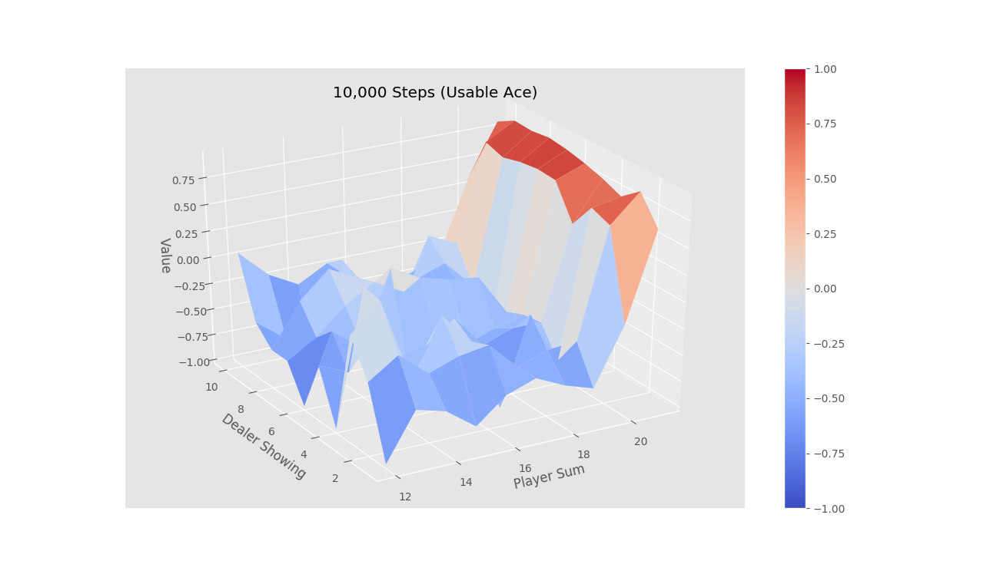
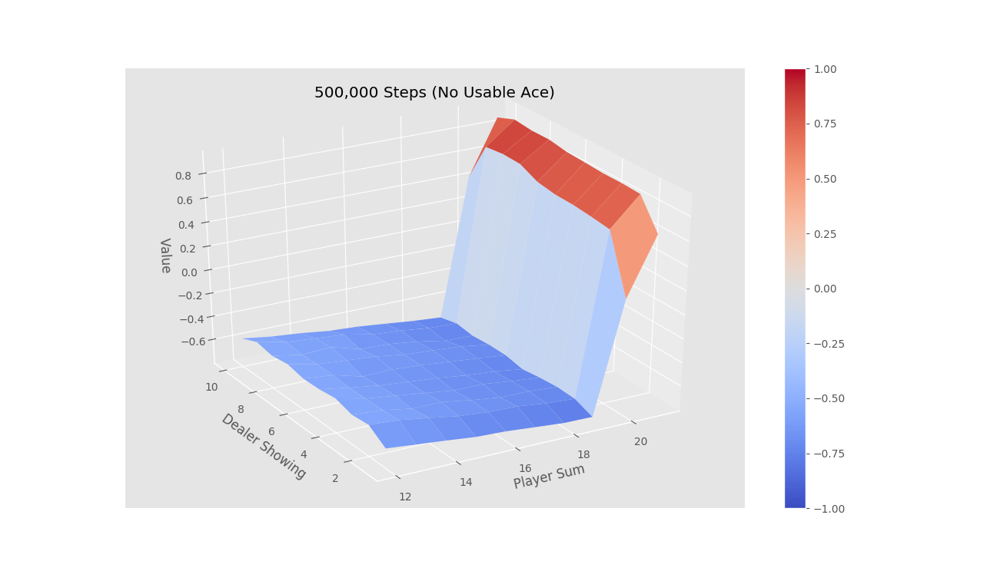

# Week 4: Model-Free Prediction

This week covers the model free prediction algorithms like Monte-Carlo and TD Learning. The code demonstrates the Monte-Carlo First-Visit Algorithm for the BlackJack Environment.

## Summary
- The algorithms we studied in Week 3 required that the model knows the entire dynamics of the environment and can compute what 
the outcome of its actions will be before actually performing the action. This is the reason it was called *Planning*.

- Harder RL problem is when the model doesn't know anything about the environment and instead depends on its iteractions with the environment by taking actions and observing the environment, until it learns good policy to do so. There are two approachess for learning the optimal policy without knowing the transition probabilities and the reward function.

- **Model-based**: Learn a model from its observation and use that model to *plan* (via Policy / Value Iteration) its solution.
- **Model-Free**: Rely on trial-and-error experience for action selection. Here, we miss the transition probabilities as well
                  as the reward function. There are again 2 approaches for this:
    
    - **Passive Learning**: Here, the model always performs a particular action in a particular state and simply learns the                                 utility of being in that state. This it the case of *Model Free Prediction*.
    
    - **Active Learning**: Estimate the optimal policy by moving in the environment. This is 
                           the case of *Model Free Control* ([Week 5](https://github.com/dalmia/David-Silver-Reinforcement-learning/tree/master/Week%205)).
                           
Characteristics of Model free prediction algorithms:

- Policy already given
- Learn directly from episodes of experience. 

### Algorithms

- Monte-Carlo Learning (MC):
  - Applicable to episodic MDPs (those which terminate)
  - Idea - Use the empirical mean (instead of the expectation) of sample returns across many episodes as the value for a particular state. This works because of the law of large numbers.
  - 2 Methods: *First-Visit* (count only the first time a state is visited in an episode) and *Every-Visit* (multiple visits possible for each state in an episode).
  - Mean is calculated incrementally with a weight added to decrease the significance of older values.
 
- Temporal Difference Learning
  - Learn from incomplete sequences (bootstrapping) - Make a guess -> Move some steps -> Make another guess -> Use this guess to improve our original guess
  - Several advantages over MC - facilitates online learning, can learn without the final outcome, less noisy (hence, low variance, although there's some bias too) 
  - TD(0) looks at the next time step, while MC is essentially TD(1), which looks till the episodes ends. TD-lambda is in the middle.
  - n-step predictors: Instead of just looking one step ahead (TD(0)), can look n steps ahead (= MC when n = infinity). These n-predictors can be combined by taking the geometrically weighted average -> this brings in the lambda parameter. Finally, we try to predict this geometrically weighted average of the n-step estimators for all n.
  - Till now, we looked at the forward view, but need to look at the backward view to make it computationally feasible using the idea of eligibility traces.
  - The final TD-lambda algorithm involves updating the eligibility traces for each state during each step of an episode and subsequently updating the value function corresponding to that state, where a fixed amount of change is weighted by the eligibility trace of each state.
  - Updates can be done both offline as well as online.
  
- Batch MC / TD
  - Have K episodes of experience and need to learn by repeatedly iterating over them.
  - MC reduces the mean square error while TD tries to build an MDP that best fits the data (i.e Max Likelihood).

## Running the code

```
python model_free_prediction.py
```
## Results

- After running for 10000 iterations
  
  
  
- After running for 500000 iterations
  
  
  
## References
https://github.com/dennybritz/reinforcement-learning/tree/master/MC
