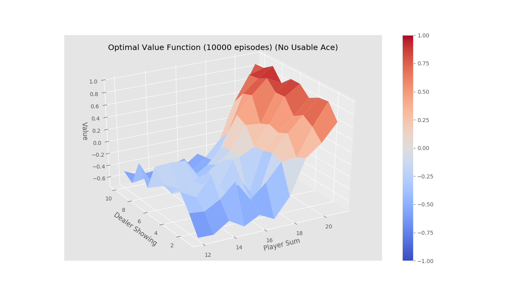
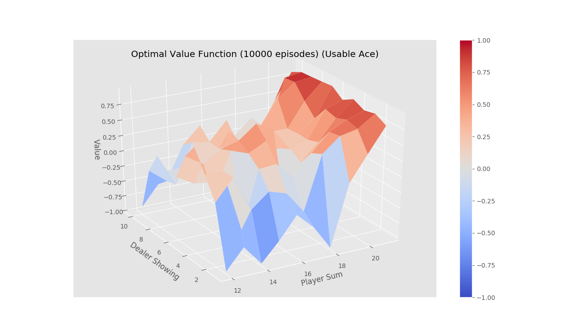
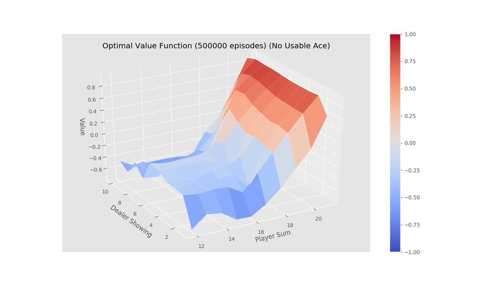
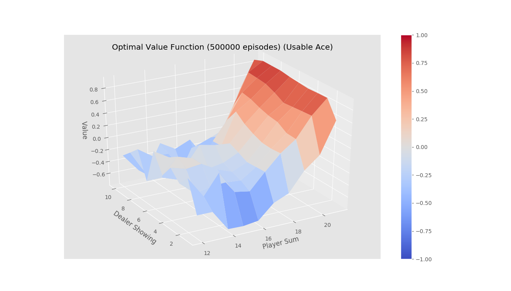

# Week 5: Model Free Control

This week covers the model free control algorithms like the Monte-Carlo and TD equivalent, along with the famous Q-learning algorithm. The code demonstrates these algorithms in different environments.

## Summary

- Last week, we studied how to do model free prediction, given a policy. Model Free control refers to finding the optimal policy.
- 2 types:
  - **On-policy**: Learning a policy while following that policy (e.g. learning by self-play).
  - **Off-policy**: Learning a policy while following some other policy (e.g. learning by following humans).
- Similar to Policy Iteration, we keep on iterating through the (Policy Evaluation -> Policy improvement) cycle.
- There are two things that differ from the usual policy iteration:
  - We can't use the state value function here as it would require a model. 
  
    Remedy: We choose to optimize the action value function Q. The intuition here is that we try to evaluate the long-term term reward we would get by taking various actions, in a given state and 
    simply pick the action that gives the maximum reward. This no longer needs a model -> we just have one state and a list of possible actions.
    
  - We can't choose the best policy greedily as we might end up never visiting specific states / taking specific actions, which means that we are not evaluating them correctly (as we are never evaluating them) and might miss out on the optimal result.
    
    Remedy: We choose to do ∈-greedy exploration instead, where we choose the greedy action with probability (1 - ∈) and a random action with probability ∈. This leads to a good trade-off between exploration and exploitation. Also, the ∈-greedy exploration makes sure that the policy is always improved (Refer notes for Proof).
    
- So, finally, we use a model free prediction algorithm for policy evaluation and the ∈-greedy exploration technique for policy improvement.
- **GLIE**: To capture the trade-off between exploration & exploitation as well as to reach the optimal policy (where there won't be much exploraton). Idea is to come up with such a schedule such that the following 2 conditions are met:
  - All state-action pairs are visited infinitely often.
  - It converges to the optimal greedy policy.
  
  Following this, ∈ is used alongside a schedule -> ∈_k = 1/k 

- In the TD equivalent of this, we don't need to wait for the entire episode and can instead update after each step in the episode. This is the idea behind SARSA -> Initially in state S and took action A -> Environment caused the agent to move to state S' -> Sample action A' from S' based on current policy -> Update ONLY Q(S, A). Finally, TD(0) can be replaced by TD(λ), in which case it is called SARSA (λ).

- **Off-Policy Learning**: Evaluate target policy π, following behaviour policy μ. 
- Many use cases:
  - Re-use experience from old policies.
  - Want a deterministic optimal policy but also want to keep exploring.
- Importance sampling (IS) -> Method for sampling returns from μ to evaluate π -> Not used too much.

- **Q-Learning** -> Best for Off-Policy Learning: 
  - No IS
  - Make use of Q-values
  - Sample an action A from μ, as well as an alternate successor action A' from π. Update Q(S, A) towards the value of the successive action, i.e. Q(S', A'). This allows both the policies to improve. Learn greedy policy (π) from exploratory policy (μ). π is greedy w.r.t. Q(S', A') and μ is ∈-greedy w.r.t. Q(S, A). This further simplifies the Q-learning objective.
   
## Running the code

```
python model_free_prediction.py
```
## Results

- First Visit Monte-Carlo for on-policy learning
  - After running for 10000 episodes
    
    

  - After running for 500000 episodes
    
    
  
## References
https://github.com/dennybritz/reinforcement-learning/tree/master/MC
